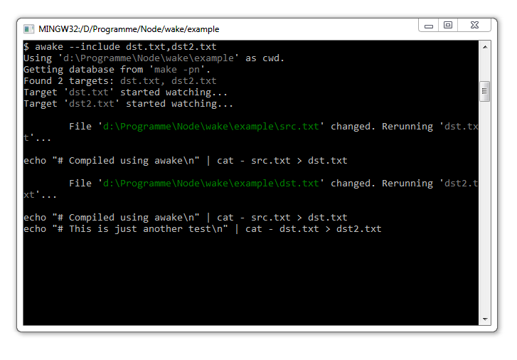

awake
=====

... is a file watcher which reruns your `make` targets when their dependent files change.

Installation
=====

Ensure to have [Node.js](http://www.nodejs.org) installed.

```
npm install -g awake
```

Usage
=====



`awake` will search for a `Makefile` in your current working directory and read its targets from it.
You can specify an alternative directory to look up using the `--directory` option:

````bash
# Uses ./ as cwd
awake

# Uses ../example as cwd
awake --directory ../example
```

You're able to whitelist (`--include`) and blacklist (`--exclude`) targets:

```bash
# Only run dst.txt and foo.html (and not hello.png)
awake --include dst.txt,foo.html

# Allow every taget except hello.png
awake --exclude hello.png
```

Under the hood
=====

`awake` uses makes `--print-database` option to get a "compiled" version of the makefile which lists all targets and the files on which they depend.
By default `awake` will run `make -pn` in your cwd but you can also read the output from a file:
```bash
awake --make-database make-pn.txt
```
